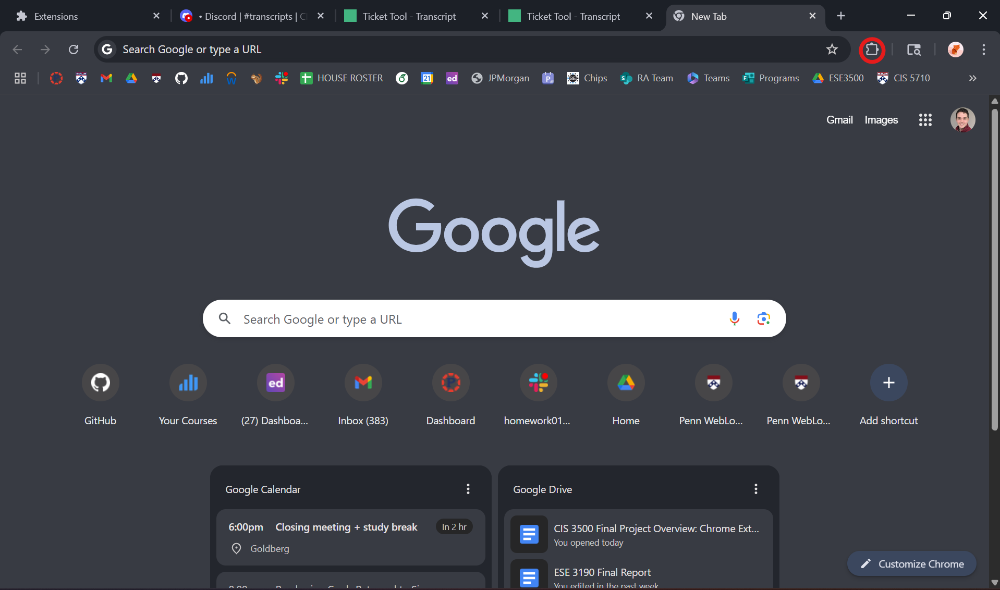
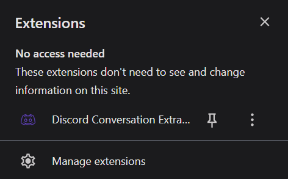
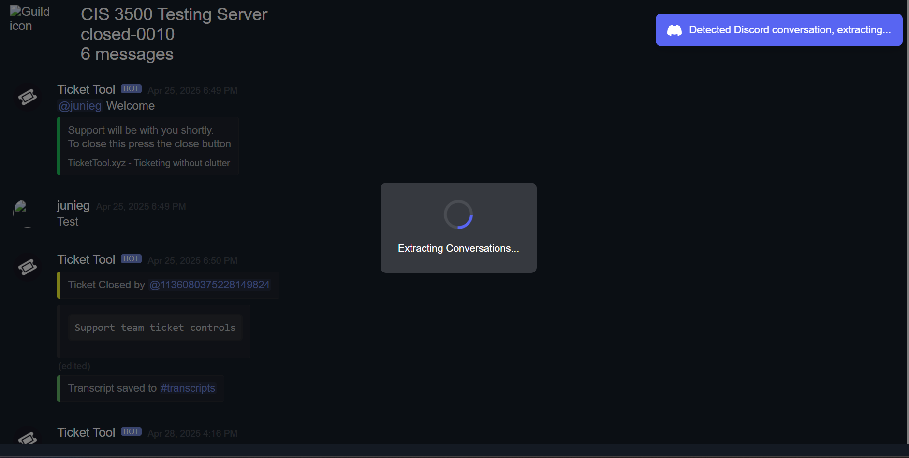

# Testing

This document contains procedures to test the functionality and quality of our discord ticket extractor Chrome extension.

## Interface Testing

### Test Case 1: Extension Toolbar Display

**Steps:**
1. Open a new Chrome tab.
2. Click on the extension icon in the toolbar.

**Expected Results:**
- The extension icon should be visible in the toolbar.
- Clicking the icon should display the extension menu.

---

### Test Case 2: Sidebar Initialization

**Steps:**
1. Click on "Discord Conversation Extractor" in the extension menu.
2. Verify that the sidebar opens with no data populated.

**Expected Results:**
- The sidebar should open successfully.
- The sidebar should display an empty state with no data.

---

### Test Case 3: History Initialization

**Steps:**
1. Open the extension sidebar.
2. Click on the "History" tab.

**Expected Results:**
- The history tab should open.
- The history should be empty if no tickets have been processed.

---

### Test Case 4: Ticket Extraction Without Sidebar

**Steps:**
1. Open a Discord ticket without opening the extension sidebar.
2. Verify that the ticket extraction screen appears.

**Expected Results:**
- The ticket extraction screen should display correctly.

---

### Test Case 5: Ticket Population in Sidebar

**Steps:**
1. Open the extension sidebar after opening a Discord ticket.
2. Verify that the tickets are populated in the sidebar.

**Expected Results:**
- The sidebar should display the extracted tickets.

---

### Test Case 6: History Update After Ticket Extraction

**Steps:**
1. Open a Discord ticket and extract it using the extension.
2. Open the "History" tab in the sidebar.

**Expected Results:**
- The extracted tickets should appear in the history tab.

**If using this document, conduct all the tests in order. If you encounter an error, redownload the extension and isolate the test to see what exactly is going wrong.**

### Test Case 7: Sidebar Resizing

**Steps:**
1. Open the extension sidebar.
2. Attempt to resize the sidebar by dragging its edges.

**Expected Results:**
- The sidebar should be resizable.
- The content inside the sidebar should adjust dynamically to fit the new size.

---

### Test Case 8: Error Handling for Invalid Tickets

**Steps:**
1. Open a Discord ticket with invalid or corrupted data.
2. Attempt to extract the ticket using the extension.

**Expected Results:**
- The extension should display an error message indicating the issue.
- The sidebar and history should remain unaffected.

---

### Test Case 9: Multiple Ticket Extraction

**Steps:**
1. Open multiple Discord tickets in separate tabs.
2. Extract each ticket using the extension.
3. Open "History".

**Expected Results:**
- All extracted tickets should appear in the history.
- Each ticket should be displayed with its corresponding metadata (e.g., timestamp, ticket ID).

---

### Test Case 10: Clearing History

**Steps:**
1. Open the extension sidebar.
2. Navigate to the "History" tab.
3. Click on the "Clear History" button.

**Expected Results:**
- All tickets in the history tab should be removed.
- A confirmation message should appear indicating that the history has been cleared.

# Prompt Testing

This document contains test cases for prompt-based functionality in the Discord ticket extractor Chrome extension. These tests are designed to validate the behavior of the extension when interacting with Discord tickets using prompts.

## Test Case 1: Extracting Ticket Summary

**Description:**
Test the ability of the extension to generate a summary of a Discord ticket.

**Inputs:**
- Discord ticket containing a conversation with 10 messages.
- Prompt: "Summarize this ticket in 3 sentences."

**Expected Outputs:**
- A concise summary of the ticket in 3 sentences.
- The summary should capture the key points of the conversation.

**Current Behavior:**
- The extension generates a summary but occasionally misses important details.

**Model(s) Used:**
- OpenAI GPT-4o

---

## Test Case 2: Extracting Actionable Items

**Description:**
Test the ability of the extension to extract actionable items from a Discord ticket.

**Inputs:**
- Discord ticket containing a conversation with 15 messages, including requests and tasks.
- Prompt: "List all actionable items from this ticket."

**Expected Outputs:**
- A list of actionable items derived from the conversation.
- Each item should be clear and concise.

**Current Behavior:**
- The extension identifies actionable items but sometimes includes irrelevant details.

**Model(s) Used:**
- OpenAI GPT-4o

---

## Test Case 3: Categorizing Tickets

**Description:**
Test the ability of the extension to categorize a Discord ticket based on its content.

**Inputs:**
- Discord ticket discussing a technical issue.
- Prompt: "Categorize this ticket into one of the following categories: Technical Support, Billing, General Inquiry."

**Expected Outputs:**
- The ticket is categorized as "Technical Support."

**Current Behavior:**
- The extension categorizes tickets accurately in most cases but struggles with ambiguous content.

**Model(s) Used:**
- OpenAI GPT-4o

---

## Test Case 4: Generating Follow-Up Questions

**Description:**
Test the ability of the extension to generate follow-up questions for a Discord ticket.

**Inputs:**
- Discord ticket with incomplete information about a user's issue.
- Prompt: "Generate 3 follow-up questions to clarify the user's issue."

**Expected Outputs:**
- Three relevant follow-up questions that help clarify the issue.

**Current Behavior:**
- The extension generates follow-up questions, but they are sometimes too generic.

**Model(s) Used:**
- OpenAI GPT-4o

---

## Test Case 5: Summarizing Multiple Tickets

**Description:**
Test the ability of the extension to summarize multiple Discord tickets at once.

**Inputs:**
- Three Discord tickets, each containing a conversation with 8-12 messages.
- Prompt: "Summarize these tickets in a single paragraph."

**Expected Outputs:**
- A single paragraph summarizing the key points from all three tickets.

**Current Behavior:**
- The extension generates a summary but occasionally omits details from one or more tickets.

**Model(s) Used:**
- OpenAI GPT-4o

